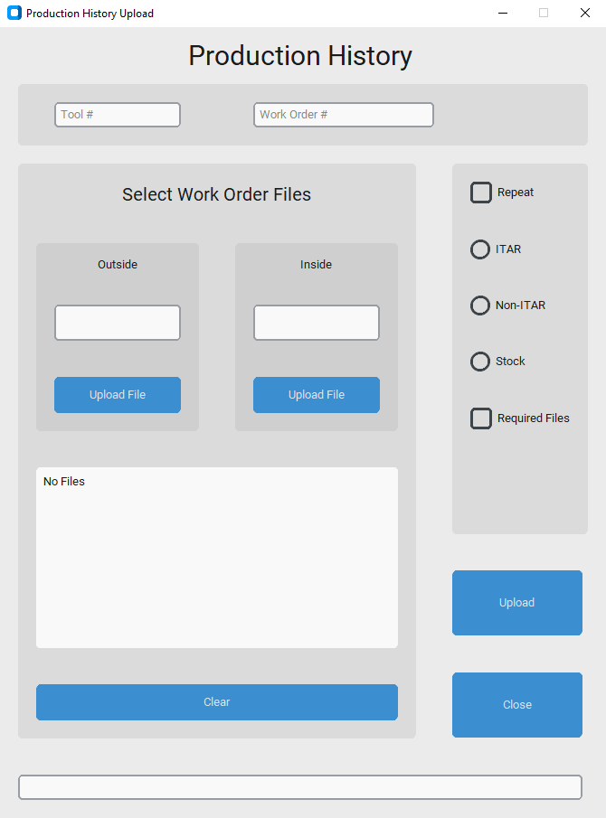
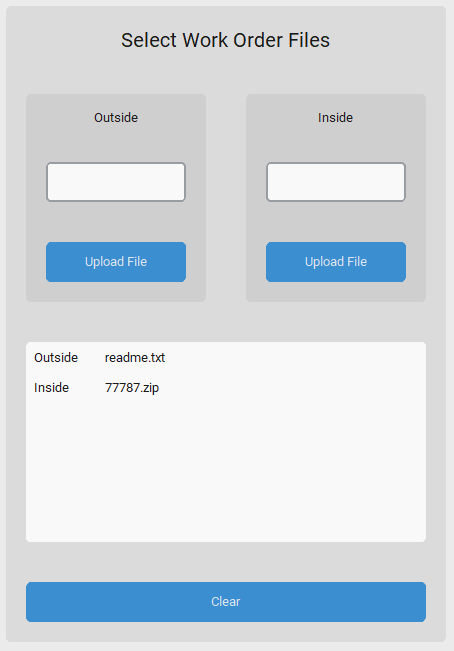
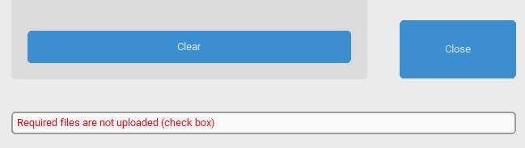

# Disclaimer
The code in this repo has undergone some changes as to not disclose sensitive information. This includes changing the use case, the directory, and some of the terms.

# Production History upload
This app is used to create a folder structure in a predetermined directory, then populates the created or appended folders with user input files. Thus, streamlining a teams (sales and/or customer service) ability to upload folders and files to a shared space in turn, makes accessing files much more predictable. Additionally, this app is made to work alongside other apps used by other teams, hence the standardization and additional team folders created.

Ex. Recieving an email from a customer with multiple files attached then adding one's own paperwork to the customer files. Instead of manually creating a new folder for every customer, risking typos or variance in naming from user to user, they can all be placed in to one directory with a new folder created for every new customer files. If the customer sends more files for the same job, this app will add on to the existing files in its own folder to differentiate from the existing ones.

## Setup
### Running the program through terminal / vscode
If you want to run the program with vscode, you will first have to open the directory where this program is located.

Make sure that you have python version 3 and up for this to work as intended.

Once the directory is open, it is recommended that you set up a virtual environment with python; This is to keep all of the installs seperate from your machine. 

On Windows:
* Go to the vscode terminal.
* Type in the command "python -m venv venv"
* Type in the command "./venv/Scripts/activate.bat"

The first command will create a python virtual environment. The second command will activate the environment to let you work within a controlled area.

The next step is to install all of the packages needed for the program to run correctly.

Go back to the terminal (if a new terminal was created, use that one) and do the following:
* Type in the command "pip install -r requirements.txt"

This will install all of the correct versions of every package used.

To run the program, use the command below:
* python ./ProductionHistory.py

### Running the program with an excecutable
Due to permission settings, IT must create the executable file. If given permission, the executable can be created with pyinstaller, py2exe, and so forth.

Using the executable:
- Navigate to the location of the executable.
- Run the executable by double clicking it or by typing the name of the executable in the terminal.

## Use
When the program is ran, a window titled "Production History Upload" will appear; This is the only window that will be used.

### Required
In order to get the program to work, there are certain requirements that need to be met which are listed below:

1. A tool number must be entered.
2. A production / work order must be entered.
3. There must be at least one file in the Outside upload section.
4. There must be at least one file in the Inside upload section.
5. The Required Files check box must be selected.

These requirements are put in place to avoid any unwanted / incomplete uploads.

### Work Order and Tool Numbers

The tool number must be a 5 digit input. If the value is not more or less than 5 or the value is not composed of just digits, a popup will open to confirm that the unorthodox value is desired.

In this new popup, you will be prompted to type in the matching value that you have previously entered. If the value does not match or the popup is closed without the tool being input, the value will not be set. If the user does want to use the same tool number, enter it exactly. This will bypass the check and allow for the tool to be accepted.

A similar check applies to the work order.

### File Uploads
There are 2 different locations where a file will be uploaded to.
The first location "Outside" is in the "02 Customer File History" folder for that respective tool number.
The second location "Inside" is in the new or existing work order folder located within the "02 Customer File History" folder.

Folder location
- Tool Folder
- - 01 Production Teams
- - - Team 1
- - - Team 2
- - - Team 3
- - - Team 4
- - 02 Customer File History
- - - Work Order
- - - - Stock

### Stock
If the stock option is selected, any files placed in the Inside section will be placed in an embedded folder within the work order folder under the name "STOCK ORDER_MM.DD.YYYY".

IF the option is left unselected or one of the other options is selected, no additional folder will be created and all of the inside files will be placed in the current work order folder.

## Errors
If there is missing criteria needed prior to uploading, the user will be notified when selecting "Upload".
Examples of missing items:
- Tool
- Work Order
- Outside files
- Inside files
- Required Files check box not selected

Having an oddly named work order or tool number are handled seperated as mentioned in the Work Order and Tool Numbers section.

If there is an error outside of the previous scope, the program.log file can be used for debugging.
